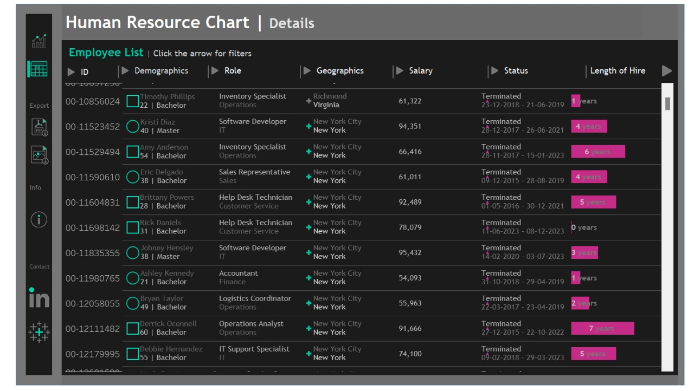

# Human Resource Analytics Dashboard (Tableau)

This repository contains a **Human Resource Analytics Dashboard** built in **Tableau**.  
The dashboard helps visualize key HR metrics such as:

- Employee demographics  
- Department-wise distribution  
- Location overview  
- Salary and income analysis  
- Hiring vs termination trends  
- Length of hire and status details  

---

## Final Output Preview

Below are static previews of the final dashboard.  
For the **fully interactive experience**, please open the Tableau workbook.

**Overview Dashboard**

**Employee List / Details Dashboard**

> _These screenshots are just previews. Use the Tableau file for filters, hover effects, and full interactivity._

---

## How to View the Interactive Dashboard

1. **Download or clone** this repository.
2. Open the Tableau workbook file:  
   **`Human_Resource_Chart.twb`** (or the `.twbx` file in this repo).
3. Open it using **Tableau Desktop** / **Tableau Public**.
4. Explore the dashboard:
   - Use filters at the top (Gender, Status, Location, etc.).
   - Hover over charts for detailed tooltips.
   - Navigate between **Overview** and **Employee List/Details**.

---

## Files in This Repository

- `Human_Resource_Chart.twb(x)` – Main Tableau dashboard file.  
- `images/hr_overview.png` – Screenshot of the Overview dashboard.  
- `images/hr_details.png` – Screenshot of the Employee List/Details dashboard.  
